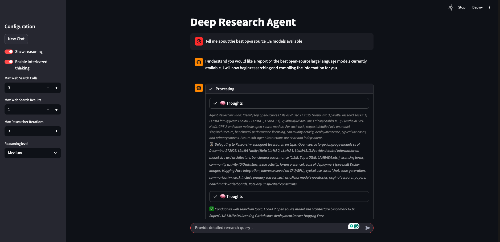

# OpenDeepResearch

OpenDeepResearch is a powerful deep research agent designed to perform autonomous, multi-step research on complex topics. It leverages open-source Large Language Models (LLMs) via Ollama and integrates web search capabilities to gather, synthesize, and report information.

This project is built using:
- **LangGraph** for agentic workflow orchestration (Researcher, Supervisor, Writer agents).
- **Ollama** for local LLM inference.
- **Ollama Web Search** for real-time information gathering.
- **Streamlit** for an interactive chat interface.

## Features

- **Deep Research**: autonomously plans and executes multi-step research iterations.
- **Local Privacy**: Runs entirely with local models using Ollama (except for web search queries).
- **Agentic Workflow**: A supervisor agent coordinates multiple research agents to cover different aspects of a query.
- **Web Search Integration**: Uses the `ollama` Python library's web search to fetch live data.



## Hardware Requirements

This project relies on running large language models locally.
- **Tested on**: Mac Studio M3 Ultra.(RAM: 96 GB (Unified Memory), CPU Core: 28, GPU Core: 60)
- **Minimum Requirements**:
  - **RAM/VRAM**: Approximately **16GB+** is required to run the default `gpt-oss:20b` (4-bit quantized) model, which is about 14GB in size.
  - **Storage**: ~15-20GB free space for model weights.
  - **Recommended**: Apple Silicon (M-series) Mac or a PC with an NVIDIA GPU (16GB+ VRAM).

## Prerequisites

- **Python**: >= 3.12
- **Ollama**: Installed and running [Download Ollama](https://ollama.com).

## Installation & Setup

### Quick Start (Interactive Setup)
We provide an interactive script to automate dependency installation, model setup, and configuration.

1.  **Clone the Repository**
    ```bash
    git clone https://github.com/sgauravm/OpenDeepResearch.git
    cd OpenDeepResearch
    ```

2.  **Run the Setup Script**
    ```bash
    python setup_interactive.py
    ```
    Follow the on-screen instructions to:
    - Install `uv` (if missing).
    - Install Python dependencies.
    - Set up Ollama models.
    - Configure your Ollama web_search API key.
    - Launch the app.

### Manual Setup
If you prefer to set up everything manually or the script doesn't work for you, follow these steps:

1.  **Install `uv`** (Recommended)
    This project uses `uv` for fast dependency management.
    ```bash
    # MacOS/Linux
    curl -LsSf https://astral.sh/uv/install.sh | sh
    ```
    *Alternatively via pip: `pip install uv`*

2.  **Install Dependencies**
    Run `uv sync` to install all dependencies and create the virtual environment automatically.
    ```bash
    uv sync
    ```
    *Note: If you prefer standard pip, you can use `pip install .`, but `uv` is highly recommended.*

## Ollama Setup

1.  **Pull/Run Required Models**
    The interactive script will guide you, or you can run these manually in a terminal:
    ```bash
    ollama run gpt-oss:20b
    ollama run qwen3:30b
    # Check for specific version tags if needed
    ollama run nemotron-3-nano:30b
    ```
    *Note: Leaving `ollama run` will start a chat session; verify the model is pulled and then exit (Ctrl+D).*

2.  **Configure Web Search**
    This project uses the `ollama` Python library for web search, which requires an API key.
    -   Obtain your API key from your Ollama account [settings](https://ollama.com/settings/keys).
    -   Set the environment variable globally (persistent):
        
        **Mac/Linux:**
        Add it to your shell profile (e.g., `~/.zshrc` or `~/.bashrc`):
        ```bash
        echo 'export OLLAMA_API_KEY="your_api_key_here"' >> ~/.zshrc
        source ~/.zshrc
        ```

        **Windows (Powershell/CMD):**
        Use `setx` to save it permanently:
        ```powershell
        setx OLLAMA_API_KEY "your_api_key_here"
        ```
        *Note: You will need to restart your terminal for changes to take effect.*
    *Ensure your `ollama` python library is version 0.6.0 or higher.*

## Usage

### Run the App
Launch the interactive research assistant using Streamlit.

First, activate the virtual environment created by `uv`:
```bash
# MacOS/Linux
source .venv/bin/activate

# Windows
.venv\Scripts\activate
```

Then run the app:
```bash
streamlit run src/web_app/streamlit_deepresearch_chat_app.py
```

*Alternatively, you can use `uv run` without activating manualy:*
```bash
uv run streamlit run src/web_app/streamlit_deepresearch_chat_app.py
```

### Configuration
- **Settings**: You can modify `src/config.py` to change default models (`gpt-oss`), adjust search limits, or tune agent parameters.
- **Environment Variables**: Manage sensitive keys (like `OLLAMA_API_KEY`) in your shell or a `.env` file (rename `.env.example` if available).

## Project Structure
- `src/deep_research_agent`: Core agent logic (Researcher, Supervisor, Tools).
- `src/web_app`: Streamlit application code.
- `src/config.py`: Configuration details for models and agents.
