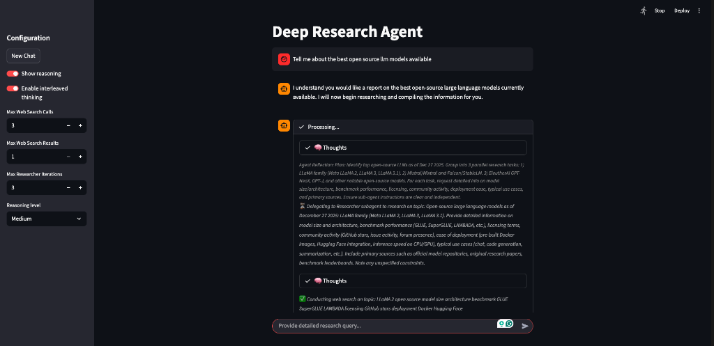
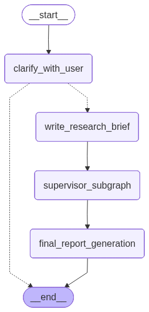

# OpenDeepResearch

OpenDeepResearch is a powerful autonomous research agent that performs multi-step deep research on complex topics. It leverages local Large Language Models via Ollama, conducts web searches to gather real-time information, and generates comprehensive research reports with visualizations.

## Features

- **Autonomous Deep Research**: Plans and executes multi-step research with clarifying questions
- **Multi-Agent Architecture**: Supervisor coordinates multiple researcher agents for comprehensive coverage
- **Web Search Integration**: Real-time information gathering using Ollama's web search
- **Research Note-Taking**: Structured note collection and synthesis across research iterations
- **Chart Generation**: Two chart backends — a deterministic matplotlib renderer driven by structured output (default, works on small models) and an opt-in plotly code-generation agent for more expressive visuals
- **Report Generation**: Professional reports in Markdown and PDF formats
- **Local Privacy**: Runs entirely with local models (except web search queries)
- **Dual Interface**: Streamlit web app and command-line interface



## Architecture

The agent uses a hierarchical multi-agent system built with LangGraph:

```
DeepResearchAgent (Main Orchestrator)
├── Clarification Phase → Asks user clarifying questions
├── Research Brief → Generates structured research plan
├── SupervisorAgent → Coordinates research
│   └── ResearcherAgents (concurrent) → Conduct web searches, take notes
└── ResearchWriterAgent → Generates final report
    ├── Report Planner → Plans report structure
    ├── SectionWriterAgent → plan → charts → writer subgraph per section
    │   ├── Chart Planner → structured output: ChartParams per chart
    │   ├── Chart Generator (dispatcher)
    │   │   ├── "structured" mode → matplotlib renderer (default)
    │   │   └── "code" mode → plotly code-generation agent
    │   └── Writer Node → final markdown, tools disabled
    └── Final Document Assembly
```



## Hardware Requirements

- **Tested on**: Mac Studio M3 Ultra (96GB RAM, 28 CPU cores, 60 GPU cores)
- **Default model**: `gemma4:e2b` — a ~2B-class efficient Gemma 4 variant that runs comfortably on modest hardware (~4–6 GB RAM).
- **Models the pipeline has been tested with** (all work, with varying quality/speed trade-offs):
  - `gpt-oss` (reasoning mode supported)
  - `gemma4:e2b` *(default)*
  - `gemma4:e4b`
  - `gemma4:26b`
  - `gemma4:30b`
- **Minimum requirements**:
  - **RAM/VRAM**: 8 GB is enough for `gemma4:e2b`. Larger Gemma 4 variants (`e4b`, `26b`, `30b`) and `gpt-oss` need proportionally more — budget 16 GB+ for those.
  - **Storage**: 5–30 GB depending on which model(s) you pull.
  - **Recommended**: Apple Silicon Mac or NVIDIA GPU.

## Prerequisites

- **Python**: >= 3.14
- **Ollama**: Installed and running ([Download Ollama](https://ollama.com))

## Installation

### Quick Start

```bash
# Clone the repository
git clone https://github.com/sgauravm/OpenDeepResearch.git
cd OpenDeepResearch

# Run the interactive setup script
python setup_interactive.py
```

The setup script will:
- Install `uv` package manager (if missing)
- Install Python dependencies
- Set up Ollama models
- Configure your Ollama API key
- Launch the app

### Manual Setup

1. **Install `uv`** (recommended package manager)
   ```bash
   curl -LsSf https://astral.sh/uv/install.sh | sh
   ```

2. **Install Dependencies**
   ```bash
   uv sync
   ```

3. **Pull the Required Model**

   The default configured in `src/config.py` is `gemma4:e2b`:
   ```bash
   ollama pull gemma4:e2b
   ```

   Other tested alternatives (pull whichever you plan to use and update `MODEL_CONFIG["model_name"]` in `src/config.py` to match):
   ```bash
   ollama pull gpt-oss         # reasoning mode supported, larger
   ollama pull gemma4:e4b      # larger Gemma 4 variant
   ollama pull gemma4:26b      # large Gemma 4 variant
   ollama pull gemma4:30b      # largest tested Gemma 4 variant
   ```

4. **Configure Web Search API Key**

   Get your API key from [Ollama settings](https://ollama.com/settings/keys) and set it:
   ```bash
   # Mac/Linux - add to ~/.zshrc or ~/.bashrc
   export OLLAMA_API_KEY="your_api_key_here"

   # Windows PowerShell
   setx OLLAMA_API_KEY "your_api_key_here"
   ```

## Usage

### Streamlit Web App

```bash
# Activate virtual environment
source .venv/bin/activate  # Mac/Linux
# or
.venv\Scripts\activate     # Windows

# Run the app
streamlit run src/web_app/streamlit_deepresearch_chat_app.py

# Or using uv directly
uv run streamlit run src/web_app/streamlit_deepresearch_chat_app.py
```

### Command Line Interface

```bash
# Run with default settings
python -m src.scripts.run_deep_research_agent

# Run with high reasoning level
python -m src.scripts.run_deep_research_agent --reasoning high

# Run with custom configuration
python -m src.scripts.run_deep_research_agent \
  --max-web-search-calls 10 \
  --max-researcher-iterations 3

# Hide reasoning output
python -m src.scripts.run_deep_research_agent --no-reasoning
```

**CLI Options:**
| Option | Default | Description |
|--------|---------|-------------|
| `--reasoning` | medium | Reasoning level (low/medium/high) |
| `--interleaved-thinking` | True | Enable interleaved thinking |
| `--max-web-search-calls` | 5 | Max web searches per researcher |
| `--max-web-search-results` | 3 | Max results per search |
| `--max-researcher-iterations` | 2 | Max research iterations |
| `--no-reasoning` | False | Hide reasoning output |

## Configuration

Edit `src/config.py` to customize agent behavior:

```python
MODEL_CONFIG = {
    "model_name": "gemma4:e2b",  # default; see Hardware section for tested alternatives
    "temperature": 0,
    "reasoning": "medium",
}

FINAL_AGENT_CONFIG = {
    "max_web_search_calls": 5,
    "max_web_search_results": 3,
    "max_llm_call_retry": 2,
    "max_researcher_iterations": 2,
    "max_concurrent_researchers": 3,
    "interleaved_thinking": True,
    "agent_reasoning": "medium",
}

CHART_AGENT_CONFIG = {
    # "structured" (default) → matplotlib renderer driven by a typed
    # ChartParams schema. Deterministic, near-100% reliable, works with
    # small general-purpose models.
    # "code" → legacy plotly code-generation agent, runs LLM-written code
    # in a sandbox. More expressive but requires a capable coder model.
    "mode": "structured",
    "palette": [
        "#1e88e5", "#e74c3c", "#1abc9c",
        "#f39c12", "#9b59b6", "#2c3e50",
    ],
    "highlight_color": "#f39c12",
    "figsize": (10, 6),
    "figsize_pie": (8, 8),
    "dpi": 150,
    "code_mode_error_context_lines": 8,
}
```

## Chart Backends

The section writer plans charts via structured output (a `ChartParams`
Pydantic schema covering chart type, title, axes, categories, series,
value format, sort order, highlight, source note, etc.) and hands the
result to a chart-generator dispatcher selected by
`CHART_AGENT_CONFIG["mode"]`.

**Structured mode (default, `"structured"`)**
- Renders matplotlib figures directly from the `ChartParams` schema. No
  code generation, no sandbox, no retries.
- Chart types supported: `bar`, `horizontal_bar`, `grouped_bar`,
  `stacked_bar`, `line`, `pie`, `donut`, `scatter`.
- Styling is fixed (palette, fonts, figsize) for visual consistency
  across a report.
- Works reliably with small general-purpose models because the LLM only
  has to fill a typed schema — it never writes code.
- Use this when: you want predictable results, your reports use
  standard chart types, or you're running a small / general-purpose
  model like Gemma 4.

**Code mode (`"code"`)**
- Runs the legacy plotly code-generation agent. The same `ChartParams`
  is rendered to a prose description and fed to a code-generation LLM
  which writes plotly code; the code runs in an isolated subprocess.
- Retries on execution errors with widened traceback context (configurable via
  `code_mode_error_context_lines`, default 8).
- More expressive: you get full access to plotly's chart types,
  per-chart styling, interactive HTML exports, etc.
- Requires a capable code model. Small general-purpose models produce
  frequent syntax and API-hallucination failures in this mode.
- Use this when: you have a strong coder model pulled in Ollama, you
  want bespoke styling per chart, or you need chart types outside the
  structured renderer's fixed set.

Switching backends is a one-line config change — the section chart
planner is mode-agnostic and always emits `ChartParams`.

## Output

Research reports are saved to the `output/` directory:
- `research_report_YYYYMMDD_HHMMSS.md` - Markdown report
- `research_report_YYYYMMDD_HHMMSS.pdf` - PDF report
- `output/charts/` - Generated chart images. Structured mode produces
  PNG only; code mode additionally produces HTML and JSON.

## Project Structure

```
OpenDeepResearch/
├── src/
│   ├── config.py                           # Model, agent, and chart backend configuration
│   ├── types.py                            # Shared types and enums
│   ├── deep_research_agent/
│   │   ├── state.py                        # LangGraph state schemas (TypedDicts)
│   │   ├── chart_generator.py              # Chart backend dispatcher (structured | code)
│   │   ├── chart_renderer.py               # Matplotlib renderer + ChartParams schema (structured mode)
│   │   ├── agents/
│   │   │   ├── final_deep_research_agent.py      # Main orchestrator
│   │   │   ├── scoping_agent.py                  # Clarification / scoping
│   │   │   ├── supervisor_agent.py               # Research coordinator
│   │   │   ├── research_agent.py                 # Web search researcher
│   │   │   ├── research_report_writer_agent.py   # Report writer pipeline
│   │   │   ├── section_writer_agent.py           # Section writer subgraph (plan → charts → writer)
│   │   │   └── chart_agent_code_with_tools.py    # Plotly code-generation agent (code mode)
│   │   ├── tools/
│   │   │   ├── search_tool.py                    # Web search tool
│   │   │   ├── plotly_python_code_executer_tool.py  # Sandbox executor for code mode
│   │   │   ├── conduct_research_tool.py
│   │   │   ├── research_complete_tool.py
│   │   │   └── think_tool.py
│   │   └── prompts/                        # Jinja2 prompt templates
│   │       ├── section_chart_planner.jinja       # Structured-output chart planner
│   │       ├── section_writer_system.jinja
│   │       ├── section_writer.jinja
│   │       ├── plotly_chart_agent_system_prompt.jinja
│   │       └── ...
│   ├── web_app/
│   │   └── streamlit_deepresearch_chat_app.py    # Streamlit UI
│   ├── scripts/
│   │   └── run_deep_research_agent.py            # CLI script
│   └── utils/
│       ├── models.py                       # ChatOllama factory
│       ├── stream.py                       # Streaming event processor
│       └── helpers.py                      # Prompt loading, date, misc
├── output/                                 # Generated reports and charts
├── assets/                                 # Screenshots and images
└── pyproject.toml                          # Project dependencies
```

## How It Works

1. **User Input**: Enter a research query
2. **Clarification**: Agent asks clarifying questions to understand scope
3. **Research Brief**: Generates a structured research plan
4. **Research Phase**: Supervisor dispatches multiple researchers who:
   - Conduct web searches
   - Analyze and summarize findings
   - Take structured notes
5. **Report Generation**:
   - Planner creates report outline
   - For each section, a chart planner decides (via structured output)
     whether any charts are needed and fills a typed `ChartParams` schema
   - The configured chart backend (matplotlib by default, or the plotly
     code agent in `"code"` mode) renders each chart to PNG
   - The writer node produces the section markdown with successful
     charts embedded; failed charts are dropped silently
   - Final document is assembled
6. **Output**: Report saved as Markdown and PDF

## Dependencies

Key dependencies (see `pyproject.toml` for full list):
- `langgraph` - Agent orchestration
- `langchain-ollama` - Ollama integration
- `streamlit` - Web interface
- `matplotlib` - Default chart backend (structured mode)
- `plotly` - Alternative chart backend (code mode)
- `weasyprint` - PDF generation
- `markdown` - Markdown processing
- `pydantic` - Structured output schemas (via LangChain)
