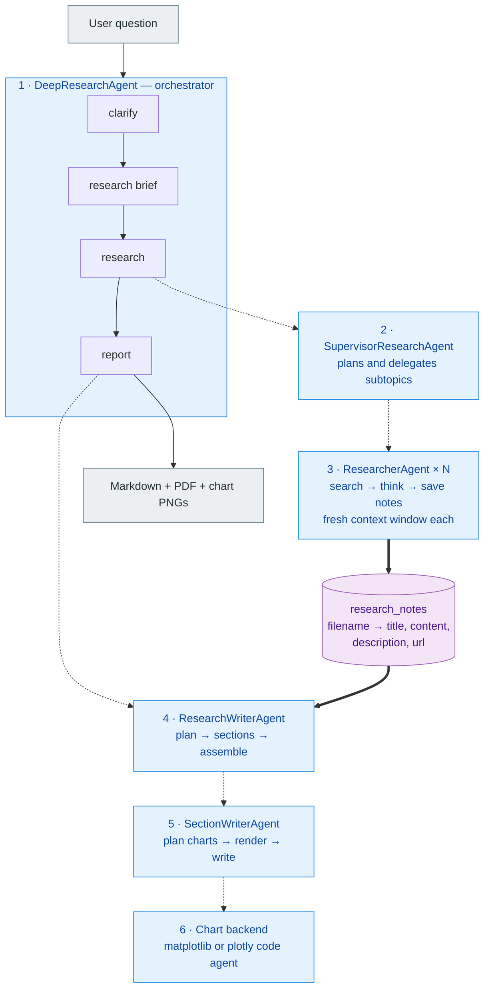
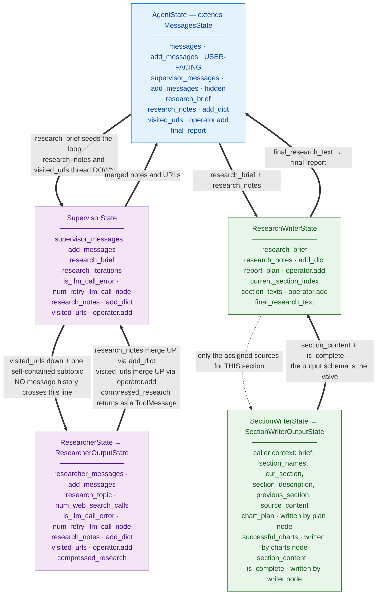
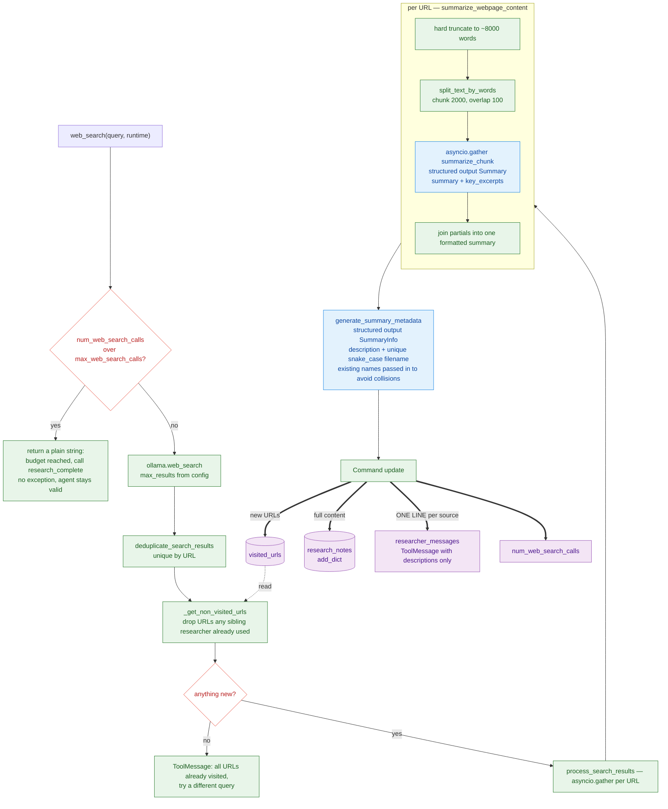
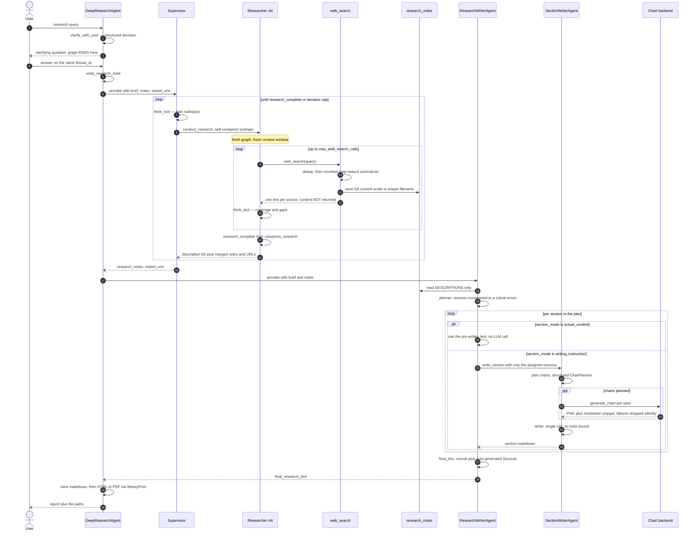

# OpenDeepResearch — Building a Deep Research Agent on Local Models

**Knowledge-sharing session · 40 minutes**

> Format note: every `##` heading is one slide. `---` separates slides. Bullets are slide content,
> `> Speaker note:` lines are what you say out loud and should not go on the slide.
> Drop this file into Marp / Slidev / Deckset / Google Slides and it converts almost 1:1.

> **Exported diagrams** live in `temp/diagrams/` — each Mermaid block in this file is also a
> standalone `.mmd` source plus a rendered `.svg` you can drop straight into slides:
>
> | File | Slide |
> |---|---|
> | `01-architecture-at-a-glance` | 2.1b |
> | `02-architecture-full-node-level` | 2.1c |
> | `03-state-channels` | 2.3b |
> | `04-web-search-pipeline` | 3.2b |
> | `05-run-sequence` | Appendix B |
>
> Re-render after editing a diagram:
> `npx -p @mermaid-js/mermaid-cli mmdc -i temp/diagrams/NAME.mmd -o temp/diagrams/NAME.svg -b white`
>
> This whole `temp/` folder is gitignored — it's your working area, not part of the repo.

---

## Timing plan

| # | Segment | Slides | Minutes |
|---|---------|--------|---------|
| 0 | Hook + what you'll take away | 2 | 2 |
| 1 | What I built & why | 4 | 5 |
| 2 | Architecture tour | 9 | 7 |
| 3 | Context engineering — the real work | 9 | 9 |
| 4 | Agent design patterns I now reuse everywhere | 7 | 6 |
| 5 | Challenges → solutions (the war stories) | 10 | 8 |
| 6 | What's still broken + what's next | 2 | 2 |
| 7 | 10 transferable lessons + Q&A | 2 | 1 + Q&A |

> Speaker note: Sections 3 and 5 are the talk. If you're running long, cut slides from section 2
> (architecture) — people can read a diagram later, they can't read your debugging history.
> Slides **2.1c** (full node-level diagram) and **2.3b** (state channels) are the first two to drop
> live — keep them in the handout, they're too dense to present from.

---

## 0. The hook

**One sentence:** I built an autonomous deep-research agent that takes a vague question, asks me a
clarifying question, sends a team of sub-agents to search the web, and hands back a cited,
chart-illustrated PDF report — running entirely on a ~2B-parameter model on my own machine.

**Why you should care even if you never build a research agent:**
- ~90% of the work was *not* agent logic. It was **context engineering** and **removing LLM calls**.
- Every hard problem I hit is a problem you'll hit on any agentic feature: context blowup,
  non-determinism, hallucinated identifiers, retry storms, streaming UX.

> Speaker note: set expectations — this is a "here's what broke and what I did" talk, not a demo reel.

---

## 0b. What you'll take away

1. A concrete, working **hierarchical multi-agent architecture** (LangGraph) you can copy.
2. Six **context-engineering techniques** that made a 2B model behave like a much bigger one.
3. A repeatable rule: **push work out of the model and into the type system or into code**.
4. A list of **LangGraph / agent footguns** that cost me evenings.

---

# Part 1 — What I built & why

---

## 1.1 What it does

Input: *"Give me a curated list of notable coffee shops across Toronto neighbourhoods."*

Pipeline:
1. **Clarify** — decides whether the question is answerable; if not, asks one question and stops.
2. **Research brief** — rewrites the chat into a precise, first-person research question.
3. **Supervisor** — splits the brief into non-overlapping subtopics, dispatches researcher sub-agents.
4. **Researchers** — search → reflect → search → save notes, with hard budgets.
5. **Writer** — plans a report outline, writes it section by section, generates charts.
6. **Output** — `output/research_report_<timestamp>.md` + `.pdf`, charts in `output/charts/`.

Two front-ends over the same event stream: a **Streamlit chat app** and a **CLI**.

> Speaker note: if you can live-demo, run the CLI with `--reasoning low` and a small query;
> a full run on a local model takes minutes, so have a pre-generated PDF and a screenshot ready.

---

## 1.2 Why I built it

- I wanted to *actually* understand the deep-research agent pattern (Anthropic's / LangChain's
  open deep-research), not just read about it.
- I wanted to know what breaks when you **don't** have a frontier model behind you.
- I wanted an excuse to go deep on LangGraph: state, reducers, subgraphs, streaming, checkpointers.

---

## 1.3 The constraint that shaped every decision

**Everything runs locally through Ollama.** Default model in `src/config.py` is a ~2B-class model.
The only external call is the web-search API.

Consequences:
- No large context window to hide behind → context discipline is mandatory, not optional.
- Weak instruction-following → prompts must be short, imperative, and mechanically checkable.
- Unreliable free-form generation → prefer **structured output** and **deterministic code** anywhere I can.

> **The design test I kept applying:** *"Would this still work on a 2B model?"*
> If the answer was no, the design was wrong — not the model.

---

## 1.4 Stack

- **LangGraph** — orchestration (`StateGraph`, `ToolNode`, reducers, `Command`, streaming, checkpointer)
- **LangChain + `langchain-ollama`** — `ChatOllama`, tool binding, structured output
- **Pydantic** — every schema the model has to fill
- **Jinja2** — every prompt is a template file, zero prompt strings in Python
- **matplotlib** (default charts) / **plotly + subprocess sandbox** (opt-in code mode)
- **Streamlit** UI, **WeasyPrint** PDF, **uv** for dependencies

~5,300 lines of Python across 5 agents, 5 tools, 14 prompt templates.

---

# Part 2 — Architecture tour

---

## 2.1 The graph of graphs

```
DeepResearchAgent                       (final_deep_research_agent.py)
├── clarify_with_user      → structured output → END or continue
├── write_research_brief   → structured output
├── supervisor_subgraph ──▶ SupervisorResearchAgent          (supervisor_agent.py)
│                           └── conduct_research tool ──▶ ResearcherAgent  (research_agent.py)
│                                                          ├── web_search
│                                                          ├── think_tool
│                                                          └── compress_research
└── final_report_generation ─▶ ResearchWriterAgent           (research_report_writer_agent.py)
                               ├── planner        (structured output → report plan)
                               ├── section_writer ─▶ SectionWriterAgent  (section_writer_agent.py)
                               │                     plan → [charts] → writer
                               │                              └─▶ chart_generator
                               │                                   ├── structured → matplotlib
                               │                                   └── code → ChartAgent (plotly + sandbox)
                               └── final_doc      (assembly + sources list)
```

> Speaker note: this is the "say it in ten seconds" version — five agents, each a compiled graph,
> composed by invocation rather than by edges. The next two slides are the same picture rendered.

---

## 2.1b At a glance



Five graphs, one note store. Solid arrows = data, dashed = "a node or a tool invokes a child graph".

> Speaker note: use this slide to give the shape, then go to the detailed diagram only if the room
> wants it. Don't read the next slide out node by node.

---

## 2.1c The whole system, node by node

```mermaid
flowchart TB

%% ─────────────── INTERFACES ───────────────
subgraph IF["INTERFACES — both consume one event stream"]
    direction LR
    UI_CLI["CLI<br/>scripts/run_deep_research_agent.py"]
    UI_WEB["Streamlit chat UI<br/>web_app/streamlit_deepresearch_chat_app.py"]
    UI_SEP["StreamEventProcessor<br/>utils/stream.py<br/>astream events → ContentType payloads"]
    UI_CLI --- UI_SEP
    UI_WEB --- UI_SEP
end

%% ─────────────── 1 · ORCHESTRATOR ───────────────
subgraph MAIN["1 · DeepResearchAgent — StateGraph AgentState, input AgentInputState, InMemorySaver"]
    M_START(["START"])
    M_CLAR["clarify_with_user<br/>structured output ClarifyWithUser"]
    M_BRIEF["write_research_brief<br/>structured output ResearchQuestion"]
    M_SUP["supervisor_subgraph<br/>node that ainvokes a child graph"]
    M_FIN["final_report_generation<br/>ainvokes the writer graph"]
    M_SAVE["_save_report / _save_pdf<br/>markdown → HTML → WeasyPrint<br/>rewrites chart paths to file URLs"]
    M_END(["END"])

    M_START --> M_CLAR
    M_CLAR -->|"need_clarification true — Command goto END"| M_END
    M_CLAR -->|"false"| M_BRIEF
    M_BRIEF --> M_SUP
    M_SUP --> M_FIN
    M_FIN --> M_SAVE
    M_SAVE --> M_END
end

%% ─────────────── 2 · SUPERVISOR ───────────────
subgraph SUP["2 · SupervisorResearchAgent — StateGraph SupervisorState"]
    S_START(["START"])
    S_LLM["llm_call<br/>lead_researcher_prompt.jinja<br/>renders max iterations and concurrency"]
    S_ROUTE{"should_continue"}
    S_TOOLS["tool_node<br/>messages_key supervisor_messages"]
    S_END(["END"])

    S_START --> S_LLM
    S_LLM --> S_ROUTE
    S_ROUTE -->|"tool calls present"| S_TOOLS
    S_ROUTE -->|"research_complete called"| S_END
    S_ROUTE -->|"llm error, retries left"| S_LLM
    S_ROUTE -->|"retries exhausted / no tool calls"| S_END
    S_TOOLS --> S_LLM
end

subgraph SUPT["Supervisor tools"]
    direction LR
    T_CR["conduct_research<br/>builds a ResearcherAgent graph per call<br/>enforces max_researcher_iterations"]
    T_TH1["think_tool<br/>only if interleaved_thinking"]
    T_RC1["research_complete"]
end
S_TOOLS --> T_CR
S_TOOLS --> T_TH1
S_TOOLS -.->|"bound but never executed —<br/>routing short-circuits to END"| T_RC1

%% ─────────────── 3 · RESEARCHER ───────────────
subgraph RES["3 · ResearcherAgent — StateGraph ResearcherState, output ResearcherOutputState — new instance per conduct_research call"]
    R_START(["START"])
    R_LLM["llm_call<br/>research_agent_system_prompt.jinja<br/>SEARCH → THINK → DECIDE protocol"]
    R_ROUTE{"should_continue"}
    R_TOOLS["tool_node<br/>messages_key researcher_messages"]
    R_COMP["compress_research<br/>DETERMINISTIC join of note descriptions<br/>no LLM call"]
    R_END(["END"])

    R_START --> R_LLM
    R_LLM --> R_ROUTE
    R_ROUTE -->|"tool calls present"| R_TOOLS
    R_ROUTE -->|"research_complete / no tool calls"| R_COMP
    R_ROUTE -->|"llm error, retries left"| R_LLM
    R_ROUTE -->|"retries exhausted"| R_COMP
    R_TOOLS --> R_LLM
    R_COMP --> R_END
end

subgraph REST["Researcher tools"]
    direction LR
    T_WS["web_search<br/>ollama.web_search → dedup → chunked summarize<br/>returns descriptions only, saves content to state<br/>enforces max_web_search_calls"]
    T_TH2["think_tool"]
    T_RC2["research_complete"]
end
R_TOOLS --> T_WS
R_TOOLS --> T_TH2
R_TOOLS --> T_RC2

%% ─────────────── SHARED STATE ───────────────
subgraph STATE["SHARED STATE CHANNELS — state.py"]
    direction LR
    NS[("research_notes<br/>Annotated dict, add_dict reducer<br/>filename → title, content, description, url")]
    VU[("visited_urls<br/>Annotated list, operator.add<br/>global dedup ledger")]
end
T_WS ==> NS
T_WS ==> VU
VU -.->|"read to filter already-seen URLs"| T_WS

%% ─────────────── 4 · WRITER ───────────────
subgraph WRI["4 · ResearchWriterAgent — StateGraph ResearchWriterState"]
    W_START(["START"])
    W_PLAN["planner<br/>report_writing_planner.jinja<br/>structured output ReportPlannerSchema<br/>built at runtime so source names are a Literal enum"]
    W_R1{"should_run_section_writer"}
    W_SEC["section_writer<br/>loops on current_section_index<br/>builds per-section source text with global indices"]
    W_MODE{"section_mode"}
    W_DIRECT["use actual_content verbatim<br/>no LLM call"]
    W_R2{"should_continue_section_writing"}
    W_FIN["final_doc<br/>concatenate sections<br/>auto-generate the Sources list"]
    W_END(["END"])

    W_START --> W_PLAN
    W_PLAN --> W_R1
    W_R1 -->|"empty plan"| W_FIN
    W_R1 -->|"plan produced"| W_SEC
    W_SEC --> W_MODE
    W_MODE -->|"actual_content"| W_DIRECT
    W_DIRECT --> W_R2
    W_R2 -->|"sections remaining"| W_SEC
    W_R2 -->|"all sections written"| W_FIN
    W_FIN --> W_END
end
NS -.->|"descriptions only, one line per source"| W_PLAN
NS -.->|"full content of assigned sources only"| W_SEC
NS -.->|"titles and URLs for the Sources list"| W_FIN

%% ─────────────── 5 · SECTION WRITER ───────────────
subgraph SW["5 · SectionWriterAgent — StateGraph SectionWriterState, output SectionWriterOutputState"]
    SW_START(["START"])
    SW_PLAN["plan<br/>section_chart_planner.jinja<br/>structured output SectionChartPlan of ChartSpec<br/>each spec carries a full ChartParams"]
    SW_R{"_route_after_plan"}
    SW_CH["charts<br/>loop the plan, call generate_chart<br/>keep successes, drop failures silently"]
    SW_W["writer<br/>section_writer_system + section_writer.jinja<br/>single LLM call, NO tools bound<br/>the response IS the section"]
    SW_END(["END"])

    SW_START --> SW_PLAN
    SW_PLAN --> SW_R
    SW_R -->|"charts planned"| SW_CH
    SW_R -->|"no charts — the common case"| SW_W
    SW_CH --> SW_W
    SW_W --> SW_END
end

%% ─────────────── 6 · CHART BACKENDS ───────────────
subgraph CG["6 · chart_generator.generate_chart — dispatcher on CHART_AGENT_CONFIG mode"]
    CG_D{"mode"}
    CG_S["render_chart — chart_renderer.py<br/>matplotlib, ZERO LLM calls<br/>bar, horizontal_bar, grouped_bar, stacked_bar,<br/>line, pie, donut, scatter"]
    CG_P["chart_params_to_prose<br/>deterministic ChartParams → prose adapter"]
    CG_D -->|"structured — default"| CG_S
    CG_D -->|"code — opt in"| CG_P
end

subgraph CA["ChartAgent — StateGraph ChartAgentState — code mode only"]
    C_START(["START"])
    C_LLM["llm_call<br/>plotly_chart_agent_system_prompt.jinja"]
    C_TOOLS["tool_node"]
    C_R{"should_continue"}
    C_END(["END"])
    C_START --> C_LLM
    C_LLM --> C_TOOLS
    C_TOOLS --> C_R
    C_R -->|"execution error, under 4 retries"| C_LLM
    C_R -->|"figure produced / no data / 12 message cap"| C_END
end

subgraph CAT["Code-mode tools"]
    direction LR
    C_EXEC["execute_plotly_chart_python_code<br/>subprocess sandbox, 30s timeout<br/>only plotly, pandas, numpy<br/>figure must be fig, figure or chart"]
    C_ND["data_not_provided"]
end
C_TOOLS --> C_EXEC
C_TOOLS --> C_ND

%% ─────────────── OUTPUTS ───────────────
subgraph OUT["OUTPUTS"]
    direction LR
    O_MD["output/research_report_TIMESTAMP.md"]
    O_PDF["output/research_report_TIMESTAMP.pdf"]
    O_PNG["output/charts/NAME.png"]
    O_EXTRA["NAME.html + NAME.json<br/>code mode only"]
end

%% ─────────────── SHARED SERVICES ───────────────
subgraph SVC["SHARED SERVICES — read by every LLM node"]
    direction LR
    SVC_CFG["config.py<br/>MODEL_CONFIG, RESEARCHER / SUPERVISOR / FINAL / CHART configs"]
    SVC_RUN["RunnableConfig configurable<br/>max_web_search_calls, max_researcher_iterations,<br/>max_concurrent_researchers, agent_reasoning, ..."]
    SVC_MODEL["utils/models.py get_model<br/>ChatOllama factory, coerces reasoning per model family"]
    SVC_PR["prompts/ — 14 Jinja2 templates"]
end

%% ─────────────── CROSS-GRAPH WIRING ───────────────
UI_SEP ==>|"astream, subgraphs true"| M_START
M_SUP ==>|"ainvoke, threads research_notes and visited_urls"| S_START
T_CR ==>|"ainvoke a fresh researcher graph<br/>isolated context window"| R_START
R_COMP ==>|"compressed_research + notes + urls<br/>returned as a ToolMessage"| S_TOOLS
M_FIN ==>|"ainvoke with research_brief + research_notes"| W_START
W_MODE ==>|"writing_instruction — write_section per section"| SW_START
SW_END ==>|"section_content appended to section_texts"| W_R2
SW_CH ==>|"chart_name + ChartParams"| CG_D
CG_P ==> C_START
CG_S ==> O_PNG
C_EXEC ==> O_PNG
C_EXEC ==> O_EXTRA
M_SAVE ==> O_MD
M_SAVE ==> O_PDF
O_PNG -.->|"embedded as markdown image refs"| O_MD

%% ─────────────── LEGEND / STYLES ───────────────
classDef llm fill:#e3f2fd,stroke:#1e88e5,color:#0d47a1
classDef det fill:#e8f5e9,stroke:#2e7d32,color:#1b5e20
classDef tool fill:#fff3e0,stroke:#f39c12,color:#7a4f01
classDef store fill:#f3e5f5,stroke:#9b59b6,color:#4a148c
classDef route fill:#ffffff,stroke:#e74c3c,color:#b71c1c
classDef out fill:#eceff1,stroke:#607d8b,color:#263238
classDef term fill:#ffffff,stroke:#90a4ae,color:#37474f

class M_CLAR,M_BRIEF,S_LLM,R_LLM,W_PLAN,SW_PLAN,SW_W,C_LLM llm
class M_SAVE,R_COMP,W_FIN,CG_S,CG_P,W_DIRECT,SW_CH,W_SEC,M_SUP,M_FIN det
class T_CR,T_TH1,T_RC1,T_WS,T_TH2,T_RC2,C_EXEC,C_ND,S_TOOLS,R_TOOLS,C_TOOLS tool
class NS,VU store
class S_ROUTE,R_ROUTE,W_R1,W_R2,W_MODE,SW_R,C_R,CG_D route
class O_MD,O_PDF,O_PNG,O_EXTRA out
class M_START,M_END,S_START,S_END,R_START,R_END,W_START,W_END,SW_START,SW_END,C_START,C_END term
```



**Legend** — 🟦 LLM call · 🟩 deterministic code · 🟧 tool · 🟪 shared state channel ·
⬜◇ routing function · ⬜ graph terminal · ⬛ output artifact.
Solid `==>` = cross-graph invocation or data hand-off. Dashed `-.->` = read access / annotation.

> Speaker note: the single most important thing to point at on this slide is the colour balance —
> count the green boxes. Most of the pipeline is deterministic code, and that was the goal.

---

## 2.2 One convention, five agents

Every agent is a class exposing `build_agent_graph() -> CompiledStateGraph`:

```python
class ResearcherAgent:
    def __init__(self, interleaved_thinking=True, agent_reasoning="medium"): ...
    def llm_call(self, state): ...
    def should_continue(self, state, config): ...
    def build_agent_graph(self) -> StateGraph: ...
```

**Key choice:** parent graphs don't *link* child graphs as edges — they **invoke** them inside a node
(or inside a tool). `supervisor_subgraph` calls `await research_supervisor.ainvoke(...)`;
`conduct_research` (a tool!) calls `await researcher_agent.ainvoke(...)`.

Why it matters:
- Every stage is **independently runnable** → `src/scripts/run_streaming_research_agent.py`,
  `run_research_writer_agent.py`, `run_chart_agent_with_tools.py`, `test_section_writer_with_chart.py`.
- Each child owns its **own state schema and its own context window**.
- I can iterate on the writer without paying for a 10-minute research run.

> Speaker note: this is the single most useful structural decision in the project. Debugging a
> monolithic agent graph is miserable; debugging four small graphs is fine.

---

## 2.3 State: deliberately duplicated, deliberately typed

`src/deep_research_agent/state.py` — one TypedDict per level:
`AgentState`, `SupervisorState`, `ResearcherState`, `ResearchWriterState`, `SectionWriterState`.

Fields are **intentionally duplicated** across levels so each subgraph owns its own channels.

Two custom reducers do the heavy lifting:

```python
research_notes: Annotated[dict[str, dict[str, dict]], add_dict]   # note store, merged across researchers
visited_urls:   Annotated[list[str], operator.add]                # global dedup ledger
```

And two **output schemas** (`ResearcherOutputState`, `SectionWriterOutputState`) so internal scratch
fields never leak up into the parent graph.

> Speaker note: mention `supervisor_messages` being a separate channel from the user-facing
> `messages` — that's what keeps tool-call chatter out of the transcript.

---

## 2.3b State channels: what flows down, what merges up



Three things to point at:
1. **`research_notes` and `visited_urls` are the only channels that cross every level** — one is a
   shallow-merge dict, the other an append-only list.
2. **Message channels never cross levels.** Each agent has its own; that's context isolation.
3. **Output schemas are the valve** — `ResearcherOutputState` and `SectionWriterOutputState` decide
   what the parent is even allowed to see.

---

## 2.4 Configuration: static defaults + runtime overrides

- **Static** (`src/config.py`): `MODEL_CONFIG`, `RESEARCHER_AGENT_CONFIG`, `SUPERVISOR_AGENT_CONFIG`,
  `FINAL_AGENT_CONFIG`, `CHART_AGENT_CONFIG`.
- **Runtime** (`RunnableConfig["configurable"]`): `max_web_search_calls`, `max_web_search_results`,
  `max_llm_call_retry`, `max_researcher_iterations`, `max_concurrent_researchers`,
  `interleaved_thinking`, `agent_reasoning`.

Nodes and **tools** read limits from `config` / `runtime.config`, never from hardcoded constants.
Same graph object serves the CLI flags and the Streamlit sidebar sliders.

---

## 2.5 Prompts are files, not strings

All 14 prompts are Jinja2 templates in `src/deep_research_agent/prompts/`, loaded via
`get_prompt_template()` and rendered with `date`, plus stage-specific variables.

Conditionals live in the template, not in Python:

```jinja

3. **think_tool** — Use to analyze what you've gathered and plan your next move.

```

Benefits: prompt diffs are readable in git, non-Python people can edit them, and one flag
(`interleaved_thinking`) rewrites three prompts consistently.

---

## 2.6 Streaming: one event vocabulary, two UIs

`src/utils/stream.py::StreamEventProcessor` consumes LangGraph's
`astream(stream_mode=["messages","updates","values","custom"], subgraphs=True)` and normalizes
everything into one payload shape:

```python
{"content": ..., "content_type": ContentType.TOOL_CALLED, "tool_name": ..., "agent_type": ...}
```

`ContentType` (in `src/types.py`) is the contract: `START_STREAM_REASON`, `STREAMING_REASON`,
`TOOL_CALLED`, `TOOL_CALL_COMPLETE`, `ASSISTANT_MESSAGE`, `RESPONSE`, `COMPRESSION_START/STOP`.

CLI and Streamlit both consume the same generator. Add an event kind → handle it in both.

---

# Part 3 — Context engineering (the real work)

> Speaker note: this is the section to slow down on. Everything here is transferable to any
> LLM feature, agentic or not.

---

## 3.1 The original sin: dumping search results into the message history

**v1 behaviour (before commit `16cfa27`):**
- `web_search` returned the full formatted summary of every page **into the tool message**.
- The researcher's message history grew with every search.
- At the end, a `compress_research` node made an **LLM call over the whole history** to summarize it.

**Symptoms:** context exhaustion after 2–3 searches, the model losing the plot mid-loop,
slow runs (compression over a huge history on a local model), and information silently dropped
by the compressor.

---

## 3.2 Fix: note-taking / context offloading

`web_search` now **writes to a note store in state** and returns only *descriptions*:

```python
new_research_notes[summary_info.filename] = {
    "title": result["title"], "content": result["content"],
    "description": summary_info.description, "url": url,
}
tool_message += f"- {summary_info.description}\n"
return Command(update={"visited_urls": new_urls,
                       "research_notes": new_research_notes,
                       "researcher_messages": [ToolMessage(content=tool_message, ...)],
                       "num_web_search_calls": num_web_search_calls})
```

The agent's context now holds **one line per source**, not the source. Full content lives in
`research_notes`, keyed by an LLM-generated `snake_case` filename, and is read later by the
*writer*, which is a different agent with a fresh context window.

Tool docstring was rewritten to teach the model the new contract:
> *"Search the web and save full content. Returns brief summaries of what each source contains —
> not the raw content. Use these summaries to assess coverage and decide whether to search again."*

**Lesson:** the agent doesn't need the data; it needs to know the data *exists* and what's in it.

---

## 3.2b The `web_search` tool, end to end



The whole point of this diagram: **the fat arrow goes to the store, the thin one goes to the
conversation.** Two LLM calls happen here, and neither of their outputs lands in the agent's context.

---

## 3.3 Fix: delete the compression LLM call entirely

Once notes were offloaded, `compress_research` became a string join:

```python
descriptions = [f"{fn}: {note['description']}" for fn, note in research_notes.items() ...]
compressed_research = "=== INFORMATION COLLECTED BY RESEARCH AGENT ===\n\n" + "\n".join(...)
```

Was: one LLM call over the entire message history, lossy and slow.
Now: deterministic, instant, lossless (nothing was dropped — it's still all in `research_notes`).

**Lesson:** every LLM call is a failure mode *and* a latency cost. If code can produce the
same string, code should.

---

## 3.4 Context isolation: each researcher gets a virgin window

`conduct_research` is a tool that builds a **brand-new researcher graph per call**:

```python
researcher_agent = ResearcherAgent(interleaved_thinking=..., agent_reasoning=...).build_agent_graph()
researcher_state = {"researcher_messages": [HumanMessage(content=research_topic)],
                    "research_topic": research_topic,
                    "visited_urls": runtime.state.get("visited_urls", [])}
```

The sub-agent sees **only its own subtopic** — not the supervisor's reasoning, not siblings' output.
That's why the supervisor prompt insists:

> *"Each question must be fully self-contained; sub-agents cannot see prior results.
> Write questions in full — no acronyms or abbreviations."*

Results flow back up as a short summary + a merged note dict. Parallelism comes free: when the
model emits multiple `conduct_research` calls in one turn, `ToolNode` runs them concurrently and
`add_dict` / `operator.add` merge the results.

---

## 3.5 Layered summarization of a single page

A single web page can blow the window on its own. `search_tool.py` handles it with map-reduce:

1. Hard-truncate to ~8,000 words.
2. `split_text_by_words(content, chunk_size=2000, overlap_size=100)`.
3. `asyncio.gather` a structured-output summarizer (`Summary`: `summary` + `key_excerpts`) per chunk.
4. Concatenate the partials.
5. A second tiny call (`SummaryInfo`) produces `{description, filename}` for the note store.

Note the schema descriptions doing prompt work:
`"Strictly should not be less than 300 words. Do not repeat or loop text."` ← that last clause exists
because small models loop.

---

## 3.6 The writer only sees what it needs

Three separate narrowings between "all research" and "the section being written":

1. **Planner** sees only `[index]. filename: one-line description` — never the content.
2. Each plan section carries a `source_file_name_list`; the planner prompt caps it:
   *"A section covering a specific subtopic should typically reference 1–4 files. Assigning 5+ files
   is a strong signal the section is too broad."*
3. **Section writer** receives only those files' contents, assembled by `_build_source_content()`.

So the most expensive context (raw page content) reaches exactly one LLM call, once, per section.

---

## 3.7 Citations: global indices, never filenames

Internal identity (`filename`) and reader-facing identity (`[3]`) are deliberately separated:

```python
filename_to_global_idx = {fn: idx for idx, fn in enumerate(research_notes.keys(), start=1)}
parts.append(f"SOURCE [{global_idx}]:\n{content}\n---\n\n")
```

The writer prompt then bans filenames outright:
> *"NEVER mention source file names in your writing… Sources are referenced ONLY via index citations `[N]`."*

`final_doc_node` regenerates the `# Sources` list from the same `research_notes` key order, so
indices are guaranteed consistent. The planner prompt is *also* told never to create a
References/Sources section, because the code owns it.

**Lesson:** give the model the smallest, most constrained vocabulary that still lets it do the job.

---

## 3.8 Interleaved thinking as context scaffolding

`think_tool` is a no-op tool that just records a reflection — its value is entirely in forcing a
structured pause. The researcher prompt makes it a protocol, not a suggestion:

> **Strict cycle: SEARCH → THINK → DECIDE.**
> *"Never call `web_search` twice in a row. Never call `research_complete` without using `think_tool` first."*

It's a config flag (`interleaved_thinking`) that toggles the tool *and* the prompt branch together,
so I could A/B "does forced reflection help this model?" — on small models it measurably reduced
redundant searching.

---

# Part 4 — Agent design patterns I now reuse everywhere

---

## 4.1 Structured output everywhere a decision is made

| Decision | Schema |
|---|---|
| Ask a clarifying question or not | `ClarifyWithUser(need_clarification, question, verification)` |
| Turn chat into a brief | `ResearchQuestion(research_brief)` |
| Page summary | `Summary(summary, key_excerpts)` |
| Note metadata | `SummaryInfo(description, filename)` |
| Report outline | `ReportPlannerSchema(report_plan: list[ReportPlan])` |
| Chart decision | `SectionChartPlan(charts: list[ChartSpec])` |
| Chart itself | `ChartParams(...)` |

Zero regex over model output anywhere in the decision path. A boolean field replaces
"if the response starts with 'QUESTION:'".

---

## 4.2 The trick I'm proudest of: make hallucination structurally impossible

The planner must cite source files. A small model happily invents file names.
So the schema is **generated at runtime from the actual keys**:

```python
def create_report_planner_schema(valid_source_filenames: list[str]):
    SourceFileLiteral = Literal[tuple(valid_source_filenames)] if valid_source_filenames else str
    class ReportPlan(BaseModel):
        ...
        source_file_name_list: list[SourceFileLiteral]
    ...
```

`Literal[...]` becomes a JSON-schema `enum`, so a hallucinated filename is a **validation error**,
not a runtime `KeyError` three nodes later.

**Lesson:** don't ask the model not to hallucinate an identifier — make the identifier space finite
and enforce it in the schema.

---

## 4.3 Tools that mutate state, not just return strings

Tools return `Command(update={...})` and read state via `ToolRuntime`:

```python
@tool(parse_docstring=True)
async def web_search(query: str, runtime: ToolRuntime):
    max_results = runtime.config.get("configurable", {}).get("max_web_search_results", 1)
    num_web_search_calls = runtime.state.get("num_web_search_calls", 0) + 1
    ...
    return Command(update={"visited_urls": ..., "research_notes": ..., "researcher_messages": [...]})
```

This is what makes note-taking possible at all: the tool writes to a *side channel* (`research_notes`)
while returning something small to the *conversation channel*.

---

## 4.4 Enforce budgets twice: in the prompt AND in the code

Prompts state limits ("Max 5 `web_search` calls", "Stop after N conduct_research calls").
Models ignore them. So the same limits are enforced mechanically:

```python
# search_tool.py
if num_web_search_calls > max_web_search_calls:
    return f"Maximum number of web search calls ({max_web_search_calls}) reached. … Call research_complete."

# conduct_research_tool.py
if research_iterations >= config.get("max_researcher_iterations", 5):
    return f"Maximum number of conduct research calls ({research_iterations}) reached. …"
```

Note the *shape* of the enforcement: it doesn't throw — it returns a **tool message that tells the
model what to do next**. The agent stays in a valid state and exits cleanly.

**Lesson:** prompts express intent; code guarantees termination. Also: a refusal is a teaching
opportunity — say what to do instead.

---

## 4.5 Errors as messages, not exceptions

Every `llm_call` node is wrapped, and failure becomes state:

```python
except Exception as e:
    return {"researcher_messages": [HumanMessage(content=f"The LLM threw the following error: {e}")],
            "is_llm_call_error": True,
            "num_retry_llm_call_node": state.get("num_retry_llm_call_node", 0) + 1}
```

and the router decides:

```python
if state.get("is_llm_call_error", False):
    return "compress_research" if state["num_retry_llm_call_node"] > max_retry else "llm_call"
```

A malformed tool call on a local model is routine, not exceptional. The graph retries N times and
then **degrades gracefully** (compress whatever was collected) instead of crashing a 10-minute run.

---

## 4.6 Explicit completion beats implicit completion

`research_complete` is a real bound tool. Both the researcher and the supervisor must call it.
Routing checks the tool *name* before `ToolNode` ever runs:

```python
if last_message.tool_calls:
    for tool_call in last_message.tool_calls:
        if tool_call.get("name") == "research_complete":
            return "__end__"
    return "tool_node"
return "__end__"
```

"No tool calls" as a termination signal is ambiguous — it also happens when a model emits filler
prose. An explicit signal is unambiguous and shows up cleanly in the UI.

---

## 4.7 Fail soft on anything cosmetic

- Chart planner raises → `charts = []`, section is written as prose.
- `ChartParams` fails validation → that chart is skipped, others continue.
- Chart render fails → dropped silently; **the writer is never told a chart failed** (so it can't
  apologize about it in the report).
- PDF generation fails → markdown is already saved; log and move on.
- No research notes at all → "The report could not be generated." instead of a stack trace.

**Rule:** a decorative failure must never take down the deliverable — and must never leak into the
model's context as something to narrate.

---

# Part 5 — Challenges → solutions (the war stories)

> Format per slide: **Problem → Symptom → Fix → Lesson.**

---

## 5.1 The ReAct section writer that wouldn't shut up

**Problem.** v1 section writer was a ReAct loop with a `create_chart` tool, and I extracted the
section text from the message history afterwards:

```python
for msg in reversed(messages):                 # _extract_content()
    if isinstance(msg, AIMessage) and msg.content and not msg.tool_calls:
        content = msg.content; break
```

**Symptoms.**
- Different model families terminate differently: one ends with the section, another ends with
  *"I've created the chart for you! Let me know if…"* → the heuristic grabbed the apology.
- The model narrated chart failures inside the report.
- I was accumulating filler/apology-stripping heuristics. Classic smell.

**Fix (commit `ef7ce18`).** Replace the loop with a deterministic three-node subgraph:

```
plan (structured output → ChartParams) → [charts, conditional] → writer (NO tools bound) → END
```

The writer's **response IS the section** — no extraction step, nothing to strip.

**Lesson.** If you're writing heuristics to find the answer inside the model's output, the
architecture is wrong. Remove the model's ability to produce the wrong shape.

---

## 5.2 The LangGraph state bug that produced empty sections

**Problem.** The new section writer's graph was built as `StateGraph(dict)`.

**Symptom.** The writer node received an **empty prompt**. Sections came out blank or generic, with
no error anywhere.

**Cause.** With an untyped `dict` schema, LangGraph doesn't know which channels exist; fields a node
doesn't return get wiped for downstream nodes. The caller-supplied context (`source_content`,
`section_description`, …) vanished after the `plan` node returned only `{"chart_plan": ...}`.

**Fix.** A proper `SectionWriterState` / `SectionWriterOutputState` pair, mirroring the existing
`ResearcherState` / `ResearcherOutputState` convention. Declared TypedDict fields get
"replace on write, persist on no-write" semantics — which is exactly what was needed.

**Lesson.** Type your graph state. `StateGraph(dict)` is a silent data-loss bug waiting to happen —
and conventions that already exist in the codebase exist for a reason.

---

## 5.3 LLM-written chart code on a small model

**Problem.** Charts were generated by having the model **write plotly code**, executed in a
subprocess sandbox (`plotly_python_code_executer_tool.py`: restricted globals, 30s timeout,
figure must be assigned to `fig`/`figure`/`chart`).

**Symptoms on small models.** Syntax errors; hallucinated plotly properties
(`marker.smoothing`, `marker.cornerradius`); `bargap` passed to `go.Bar()` instead of
`update_layout()`. Retry loops that burned minutes and often still failed.

**Fixes, in order of how much they helped:**
1. **Structured mode (the real fix).** The planner fills a typed `ChartParams` schema
   (chart type, title, axes, categories, series, value format, sort order, highlight, source note),
   and `chart_renderer.py` renders matplotlib **deterministically — zero LLM calls at render time**.
   8 chart types, fixed palette, consistent styling across a whole report.
2. Kept code mode behind `CHART_AGENT_CONFIG["mode"] = "code"` for when a capable coder model is
   available — a one-line config switch, because the planner is backend-agnostic.
3. A `chart_params_to_prose()` adapter converts the same `ChartParams` into a description for the
   code agent — **deterministically, no extra LLM call**.

**Lesson.** "Let the model write code" is powerful and expensive. If the output space is actually
finite (8 chart types!), a schema plus a renderer beats codegen on reliability, speed, and
visual consistency.

---

## 5.4 Two smaller chart lessons worth their own bullets

**More prompt ≠ better code.** The code agent had a `design_chart` node that expanded a rough
instruction into a verbose styling spec before generating code. It made small models *worse* —
more tokens to ignore, more properties to hallucinate. **Deleted the node.**

**Don't starve the retry.** The sandbox truncated tracebacks to 2 lines for "compact LLM feedback".
That removed the actual failing line, so the model couldn't fix its own bug and just re-emitted it.
Now configurable (`code_mode_error_context_lines`, default 8), keeping the exception header *and*
the traceback tail:

```python
head = lines[:1]; tail = lines[-(max_lines - 1):]
```

**Lesson.** Feedback to a model is an interface. Too verbose → ignored. Too terse → useless.

---

## 5.5 A prompt that was too good at saying no

**Problem.** The chart planner prompt was framed as "default: NO CHART" to stop spurious charts.

**Symptom.** It worked *too* well — reports full of quantitative data with zero visuals.

**Fix.** Rewrote it around **positive pattern templates** plus a mechanical three-part test:
≥3 concrete numbers, the numbers are comparable, a visual beats the prose. Then named the recurring
shapes explicitly: performance metrics across strategies, quantified improvements across functions,
market share/composition, trends over time, rankings, before/after comparisons. Plus
non-negotiable data-fidelity rules ("use ONLY numbers that appear in the source content; if a series
is incomplete, don't plan the chart").

**Lesson.** Models follow *recognizable patterns* far better than abstract criteria. When you
suppress a behaviour, check you haven't suppressed it to zero — and give examples of the
"yes" case, not only the "no" case.

---

## 5.6 Verbose XML prompts that small models ignored

**Problem.** v1 prompts were long and XML-tagged (`<Task>`, `<Available Tools>`, `<Hard Limits>`,
`<Thinking Tool Template>`) — the style that works nicely on frontier models.

**Symptom.** The small local model followed the first two rules and drifted: searching twice in a
row, never calling the completion tool, ignoring budgets.

**Fix.** Rewrote every agent prompt to be terse markdown with:
- a one-line **role** statement ("You are a Research Collector."),
- a numbered **tool list**,
- an explicit **protocol** (`SEARCH → THINK → DECIDE`),
- negative rules phrased as absolutes (*"Never call `web_search` twice in a row."*),
- **numeric limits** injected from config via Jinja.

Roughly 40% fewer tokens and materially better compliance.

**Lesson.** Prompt style doesn't transfer across model sizes. Small models want a checklist,
not an essay.

---

## 5.7 Parallel sub-agents fighting over the same state

**Problem.** Concurrent researchers writing the same state keys.

**Symptoms & fixes:**

| Symptom | Fix |
|---|---|
| Duplicate URLs researched by sibling agents | `visited_urls: Annotated[list, operator.add]` threaded **down** into each researcher and filtered inside `web_search` via `_get_non_visited_urls()` |
| Note dicts overwriting each other | `add_dict` reducer (`{**d1, **d2}`) + **unique** filenames: the metadata generator is passed `existing_names` and told *"Filename must be snake_case, and not match any name in existing_names"* |
| Supervisor losing track of coverage | Each `conduct_research` returns a compact description list, not content |

**Lesson.** With a shallow-merge reducer, **key uniqueness is a correctness requirement**. Make the
key generator aware of existing keys.

---

## 5.8 Model-family differences leaking into every agent

**Problem.** `reasoning` means different things across model families: `gpt-oss` takes
`"low"|"medium"|"high"`; gemma/llama/granite/mistral don't support it at all.

**Symptom.** Swapping the model in config broke agents in unrelated places.

**Fix.** One coercion layer, `src/utils/models.py`:

```python
if model_name.startswith(("gemma3","llama3.1","granite4","mistral")):
    reasoning = None                      # get_llm
...
if not model_name.startswith("gpt"):      # get_model
    model_reasoning = None if reasoning == "low" else True
```

Agents keep speaking in `"low"/"medium"/"high"`; the adapter translates.

**Lesson.** Put provider/family quirks behind one factory function. Never let them into agent code.

---

## 5.9 Streaming UX across nested subgraphs

**Problem.** Users stare at nothing for minutes. LangGraph emits a firehose from four nested graphs.

**Fixes in `StreamEventProcessor`:**
- `subgraphs=True` + a path check to label each event's origin
  (`main` / `supervisor` / `researcher`).
- Tool calls → human sentences (*"Delegating to Researcher subagent to research on topic: …"*).
- Paired `TOOL_CALLED` / `TOOL_CALL_COMPLETE` events so the UI can flip ⏳ → ✅ on the same line
  (Streamlit keeps a `placeholder_dict` keyed by `tool_name + agent_type`).
- Reasoning tokens streamed as `START/STREAMING/STOP_STREAM_REASON`, tracked per node+agent so
  concurrent researchers don't interleave into one thought bubble.

**A real bug worth telling (commit `0934c1a`):** *both* the researcher and the supervisor call
`research_complete`. The UI showed **"Generating final report"** every time a researcher finished.
Fix — only the supervisor's counts:

```python
if agent_type != AgentType.SUPERVISOR:
    return None
content = "Generating final report"
```

**Lesson.** When the same tool name means different things at different levels, the event needs the
*level* attached. Identity of the emitter is part of the event.

---

## 5.10 The unglamorous ones that still cost me evenings

- **Streamlit + async.** Streamlit is sync; LangGraph streams async. `run_async_generator()` drives
  `__anext__()` on a loop it creates if none exists, so the generator can be consumed from a
  `for` loop in the Streamlit script.
- **Local images in Streamlit.** `st.markdown()` won't render ``.
  `render_markdown_with_charts()` regex-splits the markdown and interleaves `st.image()` calls.
- **Local images in the PDF.** WeasyPrint can't resolve relative chart paths, so `_save_pdf()`
  rewrites `src="charts/` → `src="file:///abs/path/charts/` before rendering — plus an inline CSS
  stylesheet, because a PDF with no styling looks like a ransom note.
- **Packaging.** `pyproject.toml` was missing a `[build-system]` block, so `uv sync` **silently
  uninstalled** the editable project — imports broke for no visible reason. Added the block and
  fixed `packages.find` to `include = ["src*"]` with namespaces.
- **Docs drift.** `CLAUDE.md` / `README` described the pre-rewrite chart pipeline for a while.
  Architecture docs that live next to code still rot — they need the same review gate as code.

---

# Part 6 — What's still broken, what's next

---

## 6.1 Known rough edges (I'd rather you hear them from me)

- `conduct_research_tool.py`: if the researcher raises, `visited_urls` is never assigned before it's
  used in the `Command` → `UnboundLocalError` inside the error path. Real latent bug.
- `raw_notes` is still assembled in `compress_research` and isn't declared in `ResearcherState`
  (marked `# TODO: This might not be required`) — leftover from the pre-note-taking design.
- No semaphore on the chunk-summarization `asyncio.gather` — a very long page can fire a dozen
  concurrent calls at a local Ollama instance.
- `scoping_agent.py` duplicates `clarify_with_user` / `write_research_brief` from the main
  orchestrator. Fine as a standalone harness, but it's two copies of one prompt contract.
- `InMemorySaver` checkpointer: conversations don't survive a restart.
- **No test suite, no evals.** What I have instead: per-stage runner scripts plus fixture data
  (`data/research_notes_data.json`, the EV-sales sample in `test_section_writer_with_chart.py`) so I
  can exercise the writer and chart path without a full research run. That's a harness, not a test
  suite, and it's the biggest gap.

---

## 6.2 Roadmap

1. **Evals before features** — a fixed set of briefs, scored on citation validity, source coverage,
   chart-data fidelity. Right now "did it get better?" is vibes.
2. **Persistent checkpointer** (SQLite/Postgres) → resumable long runs.
3. **Real human-in-the-loop clarification** via `interrupt()` instead of ending the graph and
   restarting the turn.
4. Semaphore + backpressure on local model concurrency.
5. Close the `raw_notes` / duplicate-scoping-agent loops.

> Also worth a mention: an earlier branch of this project (`research_planning_offloading_agent`,
> deleted in `80a0c86`) explored the "deep agents" style — `write_todos`, a virtual filesystem with
> `ls` / `read_file` / `write_file`, task-spawning tools. I folded the useful half (context
> offloading via a filename-keyed note store) into the supervisor/researcher design and dropped the
> rest. Good material if someone asks "why not deep agents?"

---

# Part 7 — Closing

---

## 7.1 Ten transferable lessons

1. **Offload context.** Give the agent *descriptions* of data, not the data.
2. **Delete LLM calls.** If code can produce the same output, it's faster, free, and can't hallucinate.
3. **Constrain the schema, not the prompt.** `Literal[valid_names]` beats "please don't make up filenames".
4. **Type your graph state.** Untyped state silently drops fields.
5. **Enforce limits in code, explain them in prompts.** And when you refuse, say what to do instead.
6. **Treat model errors as data.** Retry-with-budget beats crash; degrade gracefully at the cap.
7. **Isolate sub-agent context.** Fresh window per subtask, self-contained instructions, merge on the way out.
8. **If you're writing extraction heuristics, fix the architecture.** Remove the model's ability to
   emit the wrong shape.
9. **Prompt style doesn't transfer across model sizes.** Small models want checklists and patterns.
10. **Make every stage independently runnable.** It's the difference between a 30-second and a
    10-minute debug loop.

---

## 7.2 Questions I expect

- *Why local models?* Privacy, cost, and because the constraint forced better engineering.
- *Why LangGraph over plain loops / CrewAI / deep-agents?* Explicit state + reducers + subgraph
  streaming. I needed to *see* and *control* state across concurrent sub-agents.
- *How long does a run take?* Minutes on the default small model — most of it is web-page
  summarization, which is why chunk-level parallelism and the note store matter.
- *Would this work with a frontier model?* Yes, and several workarounds become unnecessary — but the
  context offloading and typed-schema patterns still pay for themselves in cost and reliability.
- *What was the single biggest win?* Note-taking (3.2/3.3). It changed the ceiling of the system.

---

## Appendix A — Code map for the demo

| Talking point | File |
|---|---|
| Top-level orchestration, PDF export | `src/deep_research_agent/agents/final_deep_research_agent.py` |
| Supervisor loop, delegation, iteration cap | `agents/supervisor_agent.py` |
| Researcher loop, retry routing, compression | `agents/research_agent.py` |
| **Note-taking / context offload** | `tools/search_tool.py` |
| Sub-agent spawning as a tool | `tools/conduct_research_tool.py` |
| **Dynamic `Literal` schema** | `agents/research_report_writer_agent.py` |
| **Deterministic plan→charts→writer** | `agents/section_writer_agent.py` |
| Backend dispatcher | `chart_generator.py` |
| `ChartParams` + matplotlib renderer | `chart_renderer.py` |
| Sandbox executor (code mode) | `tools/plotly_python_code_executer_tool.py` |
| State schemas + reducers | `state.py` |
| Streaming normalization | `src/utils/stream.py` |
| Model-family coercion | `src/utils/models.py` |
| All prompts | `src/deep_research_agent/prompts/*.jinja` |

---

## Appendix B — One run, end to end



> Speaker note: good slide for the "where does the time go" question — the inner search loop and the
> per-page summarization dominate wall-clock on a local model.

---

## Appendix C — Live demo / backup plan

```bash
# Fast path for a live demo (small query, low reasoning)
uv run python -m src.scripts.run_deep_research_agent --reasoning low \
  --max-web-search-calls 2 --max-researcher-iterations 1

# The pretty one
uv run streamlit run src/web_app/streamlit_deepresearch_chat_app.py

# Show one stage only — great for explaining the chart pipeline live
uv run python -m src.scripts.test_section_writer_with_chart
```

**Backups to have open in tabs:** a finished PDF, `output/charts/*.png`, the Streamlit screenshot
(`assets/app_screenshot.png`), and the architecture diagrams (`assets/overall_agent.png`,
`assets/supervisor_agent.png`).

> Speaker note: never live-run a full research pass in a 40-minute slot. Run the section-writer
> script instead — it's ~30 seconds and demonstrates structured output + chart rendering in one go.
